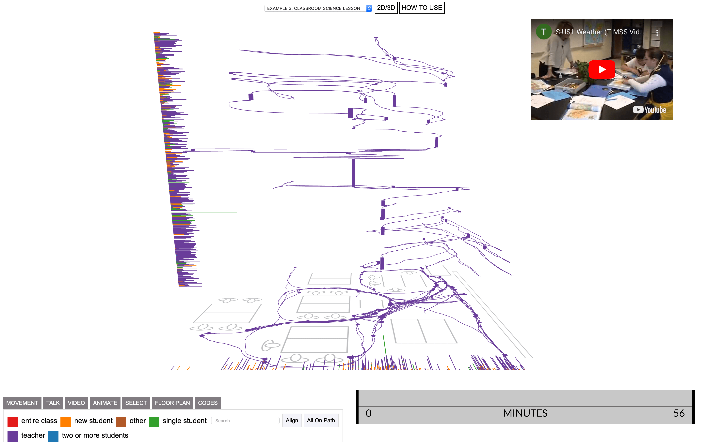

# Interaction Geography Slicer (IGS)

Hi there! This is a repository for the Interaction Geography Slicer (IGS), an open-source space-time cube system to dynamically visualize movement, conversation, and audio/video data over space and time.

IGS Features:

- **Browser-based:** Everything in your browser.
- **Visualizations:** Create dynamic 2D/3D space-time visualizations at different scales.
- **Mix multi-modal data sources:** Explore movement, conversation and video data independently or simultaneously in the same visualization.
- **Use in qualitative and quantitative projects:** Supports projects spanning micro-ethnographic analysis of phenomena such as gesture; reflective professional practice in classrooms; and larger scale analysis of urban mobility.
- **Future features:** We are rapidly developing and expanding IGS features and collaborators in this effort are welcome.

## Get started

- For more information on the IGS and how to format, collect, or transcribe your data for use in this tool please visit: [Interaction Geography Slicer](https://www.benrydal.com/software/igs)

## Reporting bugs & contributing code

- We are rapidly developing and expanding IGS features and collaborators in this effort are welcome.
- If you have found a bug, you can file it under the “issues” tab. You can also request new features here.

## Credits

This project has been generously supported by the National Science Foundation. This software uses the YouTube Video Player API and the PapaParse library by Matt Holt for CSV file processing. Classroom discussion example data is used with special permission from Mathematics Teaching and Learning to Teach (MTLT), University of Michigan. (2010). Sean Numbers-Ofala. Classroom science lesson data is made possible by the researchers and teachers who created The Third International Mathematics and Science Study (TIMSS) 1999 Video Study. Rogers Hall and David Owens have been key contributors to ideas important to this work. Christine Hsieh and Edwin Zhao contributed early discussions and ideas for a video player interface. IGS software was originally developed by Ben Rydal Shapiro at Vanderbilt University as part of his dissertation titled Interaction Geography & the Learning Sciences. Copyright (C) 2018 Ben Rydal Shapiro, and contributors. To reference or read more about this work please see [HERE](https://etd.library.vanderbilt.edu/available/etd-03212018-140140/unrestricted/Shapiro_Dissertation.pdf)

## License

This software is written in JavaScript and p5.js and licensed under the GNU General Public License Version 2.0. See the GNU General Public License included with this software for more details.
