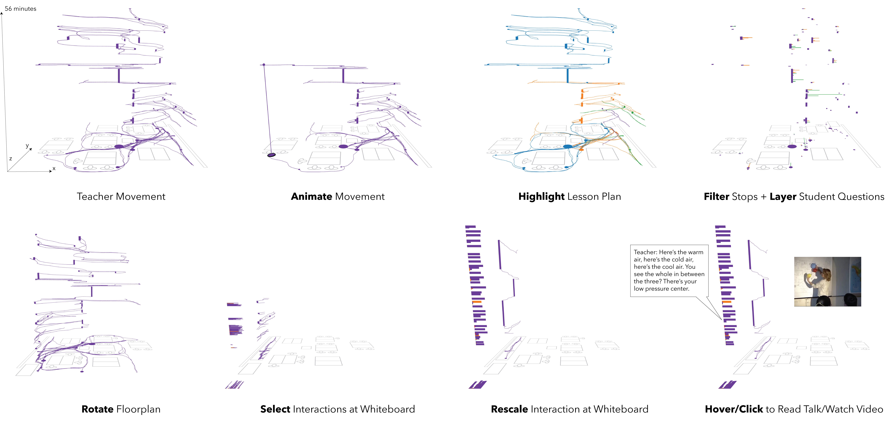

# Interaction Geography Slicer (IGS)



Welcome to **Interaction Geography Slicer (IGS)!** The IGS is an open-source tool to visualize movement, conversation, and video data over space and time. It provides fluid ways to create interactive visualizations and animations to explore how spatial and multimodal interactions evolve over time.

## Get Started

- **Visit**: https://www.interactiongeography.org

## IGS Features

- **Browser-based**: Everything in your browser.
- **Visualizations**: Create dynamic 2D/3D space-time visualizations at different scales.
- **Mix multi-modal data sources**: Explore movement, conversation, and video data independently or simultaneously in the same visualization.
- **Interactions and animations**: Create dynamic animations to communicate your data
- **Use in qualitative and quantitative projects**: Supports projects spanning micro-ethnographic analysis of gesture; mid-scale analyses of movement and conversation in settings like classrooms and museums; and larger scale analysis of urban mobility.
- **Future features**: We are rapidly developing and expanding IGS features, and collaborators in this effort are welcome.

## Frameworks and Libraries

- **Svelte**: A lightweight and powerful framework for building fast, interactive web applications.
- **Papa Parse**: Used for fast CSV data parsing in JavaScript.
- **p5.js**: For generating the custom visualizations of movement and conversation.
- **Tailwind CSS**: For visually appealing user interface.

## Installation & Setup

1. Clone the repository:

   ```bash
   git clone https://github.com/yourusername/interaction-geography-slicer.git
   ```

2. Navigate to the project directory:

   ```bash
   cd interaction-geography-slicer
   ```

3. Install dependencies:

   ```bash
   yarn install
   ```

4. Start the development server:

   ```bash
   yarn dev
   ```

5. Visit `http://localhost:5000` in your browser to see the tool in action.

## Contribute

We welcome contributions! If you'd like to contribute, please follow the [contribution guidelines](CONTRIBUTING.md) and open a pull request. For major changes, please open an issue first to discuss what you would like to change.

## License

This software is written in JavaScript and p5.js and licensed under the GNU General Public License Version 2.0. See the GNU General Public License included with this software for more details.

## Feedback

If you encounter any issues or have suggestions, feel free to open an issue or use our [feedback form](https://forms.gle/WaeHRt5Hug3fYzKW9).

## Credits

- **Developed by**: Ben Rydal Shapiro, Edwin Zhao, and contributors.
- **Supported by**: This project was generously supported by the National Science Foundation.
- **Collaborators**: Special thanks to Rogers Hall, David Owens, Christine Hsieh, Lani Horn, Brette Garner, Lizi Metts, and the TAU and SLaM research groups for feedback and discussions supporting this work.
- **Data Sources**:
  - Classroom discussion example data from _Mathematics Teaching and Learning to Teach (MTLT)_, University of Michigan (2010).
  - Classroom science lesson data from _The Third International Mathematics and Science Study (TIMSS) 1999 Video Study_.
